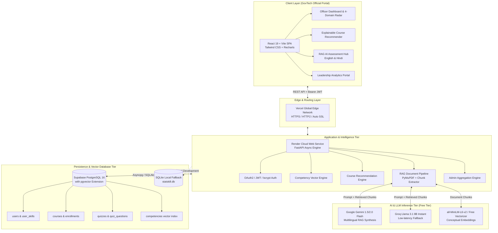

# StatSkill AI — System Architecture & Technical Specifications
### SIH Problem Statement 26101: AI-Powered Competency & Learning-Intelligence Platform

---

## 🏛️ High-Level System Architecture

The following diagram illustrates the complete end-to-end dataflow and cloud infrastructure of StatSkill AI, engineered specifically for high performance, zero operational cost (₹0 spend), and full GovTech data sovereignty.

---

## 🧩 Architectural Breakdown by Layer

### 1. Client Tier (Frontend SPA)
- **Framework**: React 19 with Vite 8 and TypeScript strict type safety (`tsc -b`).
- **Styling**: Tailwind CSS with tailored dark-mode GovTech design system (slate-900 canvas, emerald/indigo accents, crisp typography).
- **Data Visualization**: Recharts (Customized `RadarChart`, `PolarGrid`, `PolarAngleAxis`, and dual-axis `BarChart` with dynamic color thresholds and interactive custom tooltips).
- **Icons**: Lucide-React (accessible SVG iconography with zero runtime overhead).
- **Deployment**: [Vercel](https://vercel.com) — automated Git-triggered deployments with edge caching and zero cold-start delay.

---

### 2. Application & Intelligence Tier (Backend API)
- **Framework**: FastAPI (Python 3.12+), fully asynchronous with non-blocking ASGI handlers (`uvicorn`).
- **ORM & Database Access**: SQLAlchemy 2.0 with async engine (`asyncpg` / `aiosqlite`) and safe startup schema migrations.
- **RAG Document Pipeline**:
  1. Document ingestion via **PyMuPDF (`fitz`)** for high-fidelity text and structure extraction.
  2. Sentence-aware semantic chunking (500–800 token target with sliding window overlaps).
  3. Conceptual retrieval density filter ranking segments based on targeted statistical sub-skills.
  4. Prompt synthesis with strict JSON schema output formatting and multilingual translation.
- **Explainable Recommendation Engine**:
  - Matches cadre requirements against user's live 20-subskill profile.
  - Ranks course catalog items by capability deficit magnitude.
  - Dynamically synthesizes human-readable pedagogical explanations (e.g., *"Recommended because your Survey Sampling competency is 35% below benchmark"*).
- **Deployment**: [Render](https://render.com) Web Service — native containerization with auto-healing and HTTPS termination.

---

### 3. AI & Vector Inference Tier
- **Primary LLM**: Google Gemini 1.5 Flash via `google-generativeai` (free tier: 15 requests per minute, 1M token context window).
- **Fallback LLM**: Groq Llama 3.1 8B Instant via `groq` SDK (free tier: ultra-fast 300+ tokens/sec inference).
- **Multilingual Layer**: Direct zero-shot Hindi (`हिन्दी`) translation and question formulation natively supported by Gemini and Llama 3.1 without paid translation APIs.
- **Future Integration**: Designed for plug-and-play connection to Digital India **Bhashini / IndicTrans2** for 22 scheduled regional languages.

---

### 4. Persistence & Security Tier
- **Database**:
  - Cloud: [Supabase](https://supabase.com) PostgreSQL 17.6 (`db.vupdeaqxftanhturjrrq.supabase.co`) with native `pgvector` extension (v0.8.2) for vector similarity search. Active and seeded.
  - Local/Offline: SQLite with JSON-backed vectors for immediate offline demonstrations without cloud connectivity.
- **Security & GovTech Standards**:
  - Passwords hashed using standard `bcrypt` with unique cryptographic salts.
  - Session tokens generated via signed HMAC-SHA256 JWT tokens with role claims.
  - Role-Based Access Control (RBAC) separating learner and administrative leadership operations.

---

## 💰 100% Free-Tier Cost Matrix (₹0 Spend)

| Component | Provider | Free Tier Specification | Cost to Taxpayer |
| :--- | :--- | :--- | :--- |
| **Frontend Hosting** | Vercel | 100 GB bandwidth, unlimited serverless edge routes | **₹0.00** |
| **Backend API** | Render | 512 MB RAM, 0.1 CPU web service | **₹0.00** |
| **PostgreSQL & Vectors** | Supabase | 500 MB database, 1 GB storage, `pgvector` | **₹0.00** |
| **AI LLM Inference** | Google AI Studio | Gemini 1.5 Flash (1,500 free requests / day) | **₹0.00** |
| **Secondary LLM** | Groq Cloud | Llama 3.1 8B (14,400 free requests / day) | **₹0.00** |
| **Total Monthly Spend** | — | **Fully Operational Cloud Pilot** | **₹0.00 / month** |
